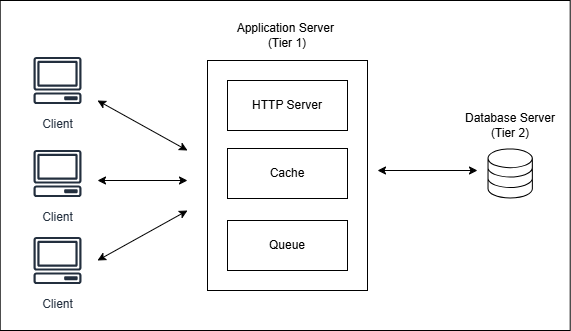

# Log Aggregator - System Architecture

This document describes the architecture of the **Log Aggregator** (Phase 1).

## Overview
A log aggregator is a system that collects logs from multiple clients, stores them persistently in a database, and provides fast access to recent logs using an in-memory cache. It is designed as a multi-tier HTTP-based system.

## Architecture Diagram

## Components

### Client
- Multiple clients send HTTP requests to the server.
- Request types: `GET /health`, `POST /logs`, `GET /logs`.

### Application Server (Tier 1)

#### HTTP Server
- Handles concurrent requests internally using CivetWeb's threading.

#### Queue
- `POST /logs` requests are added to a queue.
- Worker thread writes entries asynchronously to the database and cache.
- Prevents write-heavy requests from blocking other requests.

#### Cache
- Stores last N logs in a ring buffer for fast reads.
- `GET /logs` first checks the cache before querying the database.

### Database Server (Tier 2)
- Stores all logs persistently.
- Queries fallback to the database if logs are not in cache.

### Request Flow
- `POST /logs`: Client → Application Server → Queue → Database Server → Acknowledgment.
- `GET /logs`: Client → Application Server → Cache → (if miss) Database Server → Acknowledgment.

## Design Choices
- **Cache last N logs:** Limits memory usage and speeds up recent log access. N is configurable.
- **Queue for asynchronous writes:** Prevents blocking of client requests during database writes.
- **Eventual Consistency:** Reads may not reflect the latest writes immediately but ensures high availability.
